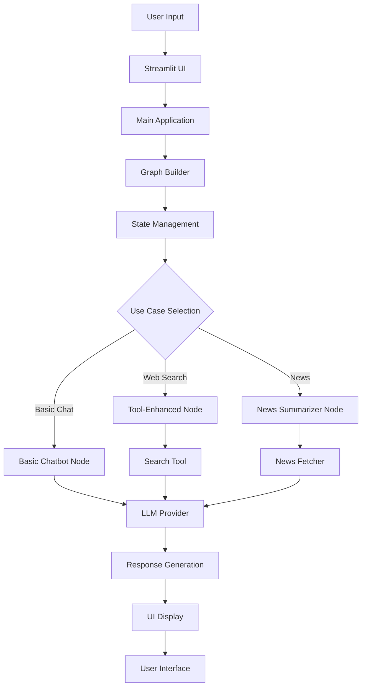

# 🤖 Agentic AI Chatbot

<div align="center">


**An intelligent conversational AI agent built with LangGraph, LangChain, and Streamlit**

[](https://agentic-chatbot-tarun.streamlit.app/)
[](https://github.com/genaitarun877/Agentic-Chatbot.git)

</div>

---

## 🌟 Features

### 🧠 **Multi-Model Support**
- **Groq Integration**: Lightning-fast inference with Llama models
- **OpenAI Compatibility**: GPT models support
- **Google Gemini**: Advanced multimodal capabilities
- **Model Flexibility**: Easy switching between different LLM providers

### 🔧 **Advanced Agent Capabilities**
- **Stateful Conversations**: Maintains context across interactions
- **Tool Integration**: Web search with Tavily API
- **Conditional Routing**: Smart decision-making in conversation flow
- **Error Handling**: Robust error management and recovery

### 🎯 **Use Cases**
- **Basic Chatbot**: Pure conversational AI without external tools
- **Web-Enhanced Chatbot**: Real-time web search integration
- **News Summarizer**: AI-powered news aggregation and summarization

### 🎨 **Modern UI**
- **Streamlit Interface**: Clean, responsive web interface
- **Real-time Streaming**: Live response generation
- **Interactive Configuration**: Easy model and use case selection
- **Message History**: Persistent conversation memory

---

## 🚀 Quick Start

### 📋 Prerequisites
- Python 3.8 or higher
- API keys for your chosen LLM provider(s)
- Tavily API key (for web search functionality)

### ⚡ Installation

1. **Clone the repository**
   ```bash
   git clone https://github.com/genaitarun877/Agentic-Chatbot.git
   cd Agentic-Chatbot
   ```

2. **Install dependencies**
   ```bash
   pip install -r requirements.txt
   ```

3. **Set up environment variables**
   Create a `.env` file in the root directory:
   ```env
   GROQ_API_KEY=your_groq_api_key_here
   OPENAI_API_KEY=your_openai_api_key_here
   GOOGLE_API_KEY=your_google_api_key_here
   TAVILY_API_KEY=your_tavily_api_key_here
   ```

4. **Run the application**
   ```bash
   streamlit run app.py
   ```

5. **Open your browser**
   Navigate to `http://localhost:8501`

---

## 🏗️ Architecture

### 📁 Project Structure
```
Agentic-Chatbot/
├── app.py                          # Main application entry point
├── requirements.txt                # Python dependencies
├── .env                           # Environment variables
├── README.md                      # This file
├── WARP.md                        # Development documentation
└── src/
    └── langgraphagenticai/
        ├── main.py                # Application orchestrator
        ├── graph/
        │   └── graph_builder.py   # Graph construction logic
        ├── state/
        │   └── state.py           # Conversation state management
        ├── nodes/
        │   ├── basic_chatbot_node.py
        │   ├── chatbot_with_tool_node.py
        │   └── news_summarizer_node.py
        ├── tools/
        │   └── search_tool.py     # Tavily web search integration
        ├── LLMS/
        │   ├── groqllm.py         # Groq API wrapper
        │   ├── Openaillm.py      # OpenAI API wrapper
        │   └── geminillm.py      # Google Gemini API wrapper
        ├── ui/
        │   ├── streamlitui/       # Streamlit UI components
        │   └── uiconfigfile.ini   # UI configuration
        └── utils/
            └── news_fetcher.py    # News aggregation utilities
```

### 🔄 Workflow Diagram



---

## 🛠️ Configuration

### 🎛️ UI Configuration
The application behavior is controlled through `src/langgraphagenticai/ui/uiconfigfile.ini`:

```ini
[UI_CONFIG]
PAGE_TITLE = Agentic AI Chatbot
LLM_OPTIONS = Groq,OpenAI,Google
USECASE_OPTIONS = Basic Chatbot,Chatbot with Web,AI News
GROQ_MODEL_OPTIONS = llama-3.1-8b-instant,openai/gpt-oss-20b,meta-llama/llama-guard-4-12b
```

### 🤖 Supported Models

| Provider | Models | Capabilities |
|----------|--------|--------------|
| **Groq** | `llama-3.1-8b-instant` | Fast inference, general purpose |
| | `openai/gpt-oss-20b` | Advanced reasoning |
| | `meta-llama/llama-guard-4-12b` | Safety-focused |
| **OpenAI** | GPT-3.5, GPT-4 | High-quality responses |
| **Google** | Gemini Pro | Multimodal capabilities |

---

## 🔧 Development

### 🧪 Testing Different Use Cases

1. **Basic Chatbot**
   - Pure conversational AI
   - No external tool dependencies
   - Fast response times

2. **Chatbot with Web Search**
   - Real-time web search integration
   - Requires Tavily API key
   - Enhanced information retrieval

3. **AI News Summarizer**
   - News aggregation and summarization
   - Multiple source integration
   - Automated content curation

### 🐛 Debugging

Enable debug mode by setting environment variable:
```bash
export DEBUG=true
streamlit run app.py
```

### 📊 Performance Monitoring

The application includes built-in performance metrics:
- Response time tracking
- Token usage monitoring
- Error rate analysis

---

## 🌐 Live Demo

**🚀 Try the live application**: [https://agentic-chatbot-tarun.streamlit.app/](https://agentic-chatbot-tarun.streamlit.app/)

### Demo Features:
- ✅ Real-time conversation
- ✅ Multiple model selection
- ✅ Web search integration
- ✅ Responsive design
- ✅ Mobile-friendly interface

---

## 📚 API Documentation

### 🔑 Required API Keys

| Service | Purpose | Get Key |
|---------|---------|---------|
| **Groq** | LLM inference | [groq.com](https://console.groq.com/) |
| **OpenAI** | GPT models | [platform.openai.com](https://platform.openai.com/) |
| **Google** | Gemini models | [makersuite.google.com](https://makersuite.google.com/) |
| **Tavily** | Web search | [tavily.com](https://tavily.com/) |

### 🔧 Environment Variables

```env
# Required for Groq models
GROQ_API_KEY=your_groq_api_key

# Required for OpenAI models
OPENAI_API_KEY=your_openai_api_key

# Required for Google Gemini models
GOOGLE_API_KEY=your_google_api_key

# Required for web search functionality
TAVILY_API_KEY=your_tavily_api_key

# Optional: Debug mode
DEBUG=false
```

---

## 🤝 Contributing

We welcome contributions! Please follow these steps:

1. **Fork the repository**
2. **Create a feature branch**
   ```bash
   git checkout -b feature/amazing-feature
   ```
3. **Commit your changes**
   ```bash
   git commit -m 'Add amazing feature'
   ```
4. **Push to the branch**
   ```bash
   git push origin feature/amazing-feature
   ```
5. **Open a Pull Request**

### 📋 Contribution Guidelines
- Follow PEP 8 style guidelines
- Add tests for new features
- Update documentation as needed
- Ensure all tests pass

---

## 📄 License

This project is licensed under the MIT License - see the [LICENSE](LICENSE) file for details.

---

## 🙏 Acknowledgments

- **LangGraph Team** - For the amazing state graph framework
- **LangChain Community** - For comprehensive LLM integration tools
- **Streamlit Team** - For the intuitive web framework
- **Groq** - For lightning-fast LLM inference
- **Tavily** - For powerful web search capabilities

---

## 📞 Support

- **Issues**: [GitHub Issues](https://github.com/genaitarun877/Agentic-Chatbot/issues)
- **Discussions**: [GitHub Discussions](https://github.com/genaitarun877/Agentic-Chatbot/discussions)
- **Email**: [Contact Developer](mailto:your-email@example.com)

---

<div align="center">

**⭐ Star this repository if you found it helpful!**

Made with ❤️ by [Tarun](https://github.com/genaitarun877)

</div>
